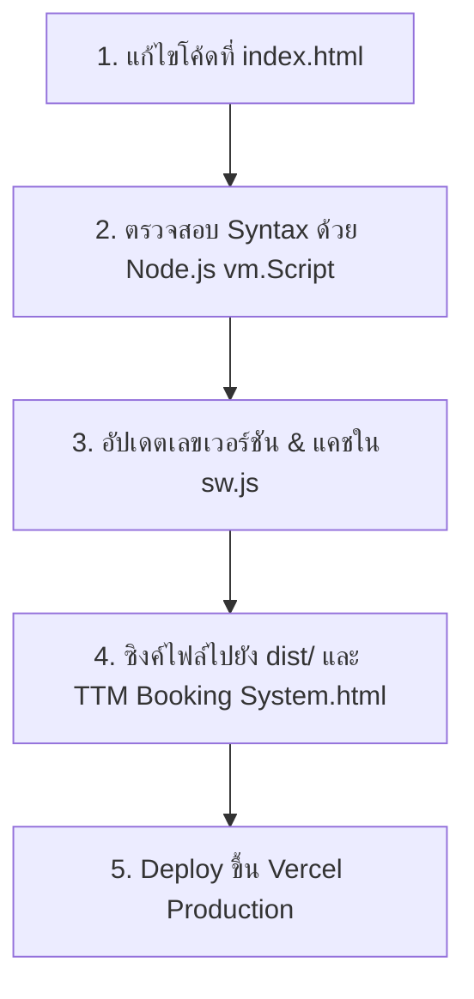

# 📋 เอกสารสรุปขั้นตอนการพัฒนาและคู่มือส่งต่องาน (Handover & Development Log)
**ระบบนัดและบริหารคลินิกการแพทย์แผนไทย โรงพยาบาลนราธิวาสราชนครินทร์ (TTM Booking System)**  
*สร้างและอัปเดตล่าสุด: 22 กันยายน 2569 (2026-09-22)*  
*เวอร์ชันปัจจุบัน:* **`v5.2.6`** | *Service Worker Cache:* **`ttm-clinic-cache-v133`**  
*Production URL:* **[https://narathiwat-massage-clinic.vercel.app](https://narathiwat-massage-clinic.vercel.app)**  
*GitHub Repository:* **[https://github.com/Nasree4/narathiwat-massage-clinic](https://github.com/Nasree4/narathiwat-massage-clinic)**

---

## 📌 สารบัญ (Table of Contents)
1. [ภาพรวมของโปรเจกต์และสถาปัตยกรรม (Project Overview)](#1-ภาพรวมของโปรเจกต์และสถาปัตยกรรม)
2. [เครื่องมือและสภาพแวดล้อมที่ต้องเตรียมบนคอมพิวเตอร์เครื่องใหม่ (Environment & Tools)](#2-เครื่องมือและสภาพแวดล้อมที่ต้องเตรียม)
3. [โครงสร้างไฟล์สำคัญในโปรเจกต์ (Project Structure)](#3-โครงสร้างไฟล์สำคัญในโปรเจกต์)
4. [สรุปงานและขั้นตอนที่ทำสำเร็จแล้ว (Completed Features & Changelog)](#4-สรุปงานและขั้นตอนที่ทำสำเร็จแล้ว)
5. [คู่มือการแก้โค้ด บิลด์ ตรวจสอบ และ Deploy (Workflow & Commands)](#5-คู่มือขั้นตอนการพัฒนาต่อ-workflow)
6. [โครงสร้างฐานข้อมูลและตาราง Supabase (Database Schema)](#6-โครงสร้างฐานข้อมูล-supabase)
7. [สถานะปัจจุบันและสิ่งที่สามารถทำต่อได้ทันที (Current Status & Next Steps)](#7-สถานะปัจจุบันและสิ่งที่สามารถทำต่อได้ทันที)

---

## 1. ภาพรวมของโปรเจกต์และสถาปัตยกรรม

- **ลักษณะระบบ:** Single Page Application (SPA) ทำงานบนเบราว์เซอร์ทุกแพลตฟอร์ม (Desktop, Tablet, Mobile) รองรับการติดตั้งแบบ Progressive Web App (PWA)
- **Frontend Stack:**
  - HTML5 + Vanilla JavaScript (ES6+)
  - Tailwind CSS (CDN)
  - Lucide Icons (CDN)
  - Service Worker (`sw.js`) สำหรับแคชไฟล์และทำงานออฟไลน์
- **Backend & Database:**
  - **Supabase Cloud:** PostgreSQL + Supabase Realtime + Supabase Auth
  - มีระบบ **LocalStorage Fallback & Cache Sync** เพื่อให้ใช้งานได้รวดเร็วแม้เน็ตช้าหรือไม่เสถียร
- **Hosting & Deployment:**
  - **Vercel Production Hosting** ผ่าน Vercel CLI / GitHub Integration

---

## 2. เครื่องมือและสภาพแวดล้อมที่ต้องเตรียม

เมื่อนำโค้ดไปเปิดบนคอมพิวเตอร์อีกเครื่อง ให้ตรวจสอบและเตรียมสิ่งเหล่านี้:

| เครื่องมือ | เวอร์ชันที่แนะนำ | หน้าที่ | คำสั่งตรวจสอบ |
|---|---|---|---|
| **Node.js** | v20.x หรือ v22.x LTS | รันสคริปต์ Sync, Build และ Syntax Checker | `node -v` |
| **npm** | v10.x ขึ้นไป | ตัวจัดการแพ็กเกจ | `npm -v` |
| **Vercel CLI** | v35+ หรือใช้ `npx vercel` | ดีพลอยต์ขึ้นเซิร์ฟเวอร์จริง | `npx vercel -v` |
| **Git** | v2.x ขึ้นไป | ควบคุมเวอร์ชันโค้ด | `git --version` |
| **VS Code / IDE** | แนะนำ | ใช้เปิดและพัฒนาโค้ด | - |

> 💡 **การล็อกอิน Vercel บนเครื่องใหม่:**  
> หากต้องการดีพลอยต์ ให้พิมพ์คำสั่ง:
> ```bash
> npx vercel login
> ```
> ล็อกอินด้วยบัญชี Vercel ที่ดูแลโปรเจกต์ `narathiwat-massage-clinic`

---

## 3. โครงสร้างไฟล์สำคัญในโปรเจกต์

```text
d:/TTM Booking System/
│
├── index.html                   # ⭐ ไฟล์หลักของระบบ (UI + CSS + JavaScript ทั้งหมดอยู่ที่นี่)
├── TTM Booking System.html      # สำเนาไฟล์หลักสำหรับเปิดรันแบบ Local ไฟล์เดี่ยว
├── sw.js                        # Service Worker จัดการแคช PWA (ต้องแก้เวอร์ชันทุกครั้งที่แก้ index.html)
│
├── dist/                        # 📦 โฟลเดอร์ Output สำหรับ Deploy ขึ้น Vercel
│   ├── index.html               # ไฟล์ที่ Vercel นำไป Serve จริง
│   ├── sw.js                    # Service Worker สำหรับ Vercel
│   └── (รูปภาพ assets ต่างๆ)
│
├── package.json                 # กำหนดสคริปต์คำสั่ง build
├── vercel.json                  # การตั้งค่า Routing, Headers, Caching บน Vercel
├── supabase-schema.sql          # โครงสร้างตารางและ Database Trigger ของ Supabase
├── supabase-auth-migration.sql   # สคริปต์ Migration บัญชีผู้ใช้เดิมเข้าสู่ Supabase Auth
│
├── scratch/                     # โฟลเดอร์สคริปต์ตัวช่วย (Helper Scripts สำหรับทดสอบและตรวจสอบ)
│   ├── apply_fixes_v525.js      # สคริปต์ตัวอย่างการตรวจสอบ syntax ด้วย Node vm.Script
│   └── apply_success_popup.js   # สคริปต์ตัวอย่างการอัปเดต Popup
│
├── HANDOVER_DEVELOPMENT_LOG.md   # 📄 ไฟล์นี้ (คู่มือส่งต่องานสำหรับเปิดเครื่องใหม่)
└── README.md                    # เอกสารคู่มือการติดตั้งเบื้องต้น
```

---

## 4. สรุปงานและขั้นตอนที่ทำสำเร็จแล้ว

### 🔹 ปัญหาเดิมและสิ่งที่ได้รับการแก้ไข (Changelog):

1. **การแก้ปัญหาชื่อผู้ช่วยซ้ำ / เด้ง (Assistant Deduplication):**
   - แก้ไขฟังก์ชัน `deduplicateAssistants()` รวมชื่อผู้ช่วยที่มี ID, ชื่อ, ชื่อเล่น หรือเบอร์โทรตรงกัน ไม่ให้แสดงรายการซ้ำ
   - ล้างข้อมูลขยะใน LocalStorage และจัดเรียงอย่างถูกต้อง

2. **ระบบจัดการผู้ช่วยแบบโมดอลแยก 3 แท็บ (Assistant Detail Modal):**
   - ปรับหน้าจัดการให้แสดงการ์ด/แถวสะอาดตา คลิกแล้วเปิด Modal ละเอียดที่มี 3 แท็บ:
     - **แท็บ 1: ประวัติการนวด (Massage History):** ดูประวัติเคสที่นวดแล้ว ค้นหา และกรองตามวัน/เดือน/ทั้งหมด
     - **แท็บ 2: จัดตารางเวร & รอบเวลา (Duty & Shift Settings):** กำหนดรูปแบบเวร (ทั้งวัน, ในเวลา, OT, กำหนดเอง, ลาเวร)
     - **แท็บ 3: ข้อมูลส่วนตัว & สิทธิ์ (Profile & Roles):** แก้ไขชื่อ เบอร์ สิทธิ์ (Admin, Staff, User)

3. **ฟังก์ชันเลือกช่วงวันที่ (Date Range Duty Scheduling):**
   - เพิ่มตัวเลือก **"📅 เฉพาะวันเดียว"** และ **"🗓️ เป็นช่วงวันที่ (Date Range)"**
   - มีปุ่มลัดช่วงวัน: `[7 วันข้างหน้า]`, `[14 วัน]`, `[จ.-ศ. สัปดาห์นี้]`, `[ทั้งเดือนนี้]`
   - มีตัวกรองเลือกวันในสัปดาห์ (จันทร์-ศุกร์ หรือทุกวัน) พร้อมป้ายคำนวณจำนวนวันอัตโนมัติ

4. **การแก้ไขปัญหาสถานะเวรไม่อัปเดต (v5.2.5):**
   - **สาเหตุเดิม:** การแสดงผลอ่านค่าจาก `asst.active` ดั้งเดิม ไม่ได้อ่านจาก `assistantDutyRosters[date]`
   - **วิธีแก้:** สร้างฟังก์ชันรวมศูนย์ `getAssistantDutyStatusForDate(asst, dateStr)` ตรวจสอบสถานะจริงของวันนั้นๆ ครบทุกจุด (สถิติด้านบน, การ์ด, แถวตาราง, และหัว Modal)
   - อัปเดตคอลัมน์ `active` ในตาราง `assistants` ของ Supabase อัตโนมัติเมื่อกดบันทึก

5. **เพิ่ม Popup แจ้งเตือนเมื่อบันทึกสำเร็จ & ปิดหน้าต่างให้อัตโนมัติ (v5.2.6):**
   - เพิ่มโมดอลแจ้งเตือน `modal-success-alert` ดีไซน์โมเดิร์น ตรงกลางหน้าจอ พร้อมไอคอนเช็คถูกสีเขียว
   - แสดงสรุป: ชื่อผู้ช่วย, วันที่/ช่วงวันที่ที่บันทึก, รูปแบบเวรที่เลือก
   - ปิดหน้าต่างจัดการผู้ช่วยทันทีหลังบันทึก ("ปิดแท็บให้เลย") พร้อมรีเฟรชข้อมูลหน้าจอหลักแบบ Real-time

---

## 5. คู่มือขั้นตอนการพัฒนาต่อ (Workflow)

เมื่อทำงานบนคอมพิวเตอร์เครื่องใหม่ ให้ทำตาม 5 ขั้นตอนนี้อย่างเคร่งครัด:



### ขั้นตอนที่ 1: แก้ไขโค้ดใน `index.html`
- ทำการแก้ไขฟังก์ชันหรือ UI ภายในไฟล์ `index.html` เป็นหลัก

### ขั้นตอนที่ 2: ตรวจสอบ Syntax Error ก่อนเสมอ (ป้องกันเว็บพัง)
- รันคำสั่งตรวจสอบสคริปต์ใน Terminal / PowerShell:
```bash
node -e "const fs=require('fs'),vm=require('vm'); const c=fs.readFileSync('index.html','utf8'); const regex=/<script\b[^>]*>([\s\S]*?)<\/script>/gi; let m, cnt=0; while((m=regex.exec(c))!==null){ cnt++; if(m[1].trim()){ new vm.Script(m[1]); } } console.log('✅ Syntax Check Passed: All ' + cnt + ' scripts compiled successfully!');"
```

### ขั้นตอนที่ 3: อัปเดตเลขเวอร์ชันและแคช Service Worker
- ใน `index.html`: อัปเดตข้อความเวอร์ชัน เช่น `v5.2.7`
- ใน `sw.js`: เปลี่ยนชื่อ `CACHE_NAME` ให้เป็นเวอร์ชันใหม่เสมอ (เช่น `ttm-clinic-cache-v134`) เพื่อบังคับให้เบราว์เซอร์ผู้ใช้ดาวน์โหลดโค้ดใหม่:
  ```javascript
  const CACHE_NAME = 'ttm-clinic-cache-v134';
  ```

### ขั้นตอนที่ 4: ซิงค์ไฟล์ไปยัง `dist/` และ `TTM Booking System.html`
- รันคำสั่ง:
```bash
npm run build
```
*(คำสั่งนี้จะคัดลอก `index.html` และ `sw.js` ไปยังโฟลเดอร์ `dist/` และอัปเดต `TTM Booking System.html` ให้ตรงกัน)*

### ขั้นตอนที่ 5: Deploy ขึ้น Vercel Production
- รันคำสั่ง:
```bash
npx vercel --prod --yes
```
- รอจนขึ้น `Aliased https://narathiwat-massage-clinic.vercel.app` แสดงว่าดีพลอยต์เสร็จสมบูรณ์

---

## 6. โครงสร้างฐานข้อมูล Supabase

โปรเจกต์เชื่อมต่อกับ Supabase ตารางสำคัญประกอบด้วย:

1. **`appointments`**: เก็บประวัติการจองคิวการนวด
   - คอลัมน์สำคัญ: `id`, `book_date`, `time_slot`, `patient_name`, `phone`, `assistant_id`, `assistant_nick`, `status`
2. **`assistants`**: ข้อมูลหลักของผู้ช่วยแพทย์แผนไทย
   - คอลัมน์สำคัญ: `id`, `name`, `nickname`, `gender`, `phone`, `email`, `role`, `active`
3. **`slot_configs`**: การตั้งค่าโควตาและตารางเวร
   - `scope = 'roster'`: บันทึกตารางเวรตามวันที่ (`config_key = YYYY-MM-DD`, `slots_json` เก็บ object ของผู้ช่วยและรอบเวลา)
   - `scope = 'assistants'`: เก็บ master list สำรองของผู้ช่วย (`config_key = 'master_list'`)
4. **`extra_services`**: รายการหัตถการเสริมและการรักษา

---

## 7. สถานะปัจจุบันและสิ่งที่สามารถทำต่อได้ทันที

- ✅ **สถานะระบบปัจจุบัน:** เสถียร 100%, ตรวจสอบ Syntax แล้วไม่มี Error, Deploy ขึ้น Production บน Vercel พร้อมใช้งาน
- 🚀 **ฟังก์ชันที่พร้อมพัฒนาต่อยอด (Backlog Ideas):**
  1. การพิมพ์/Export รายงานตารางเวรรายสัปดาห์หรือรายเดือนเป็น PDF / Excel
  2. การตั้งระบบสลับเวร (Shift Swap Request) ระหว่างผู้ช่วยด้วยกัน
  3. ระบบสถิติสรุปชั่วโมงการทำงานและการนวดรายเดือนของผู้ช่วยแต่ละคนเพื่อคิดค่าตอบแทน
  4. ระบบแจ้งเตือนคิวผ่าน LINE Notify หรือ SMS เพิ่มเติม

---
> 📞 **หากเปิดบนเครื่องใหม่แล้วพบปัญหาเรื่องสิทธิ์การ Deploy:**  
> ตรวจสอบการ Login ของ Vercel ด้วยคำสั่ง `npx vercel whoami` หรือใช้ Personal Access Token ในการยืนยันตัวตน
